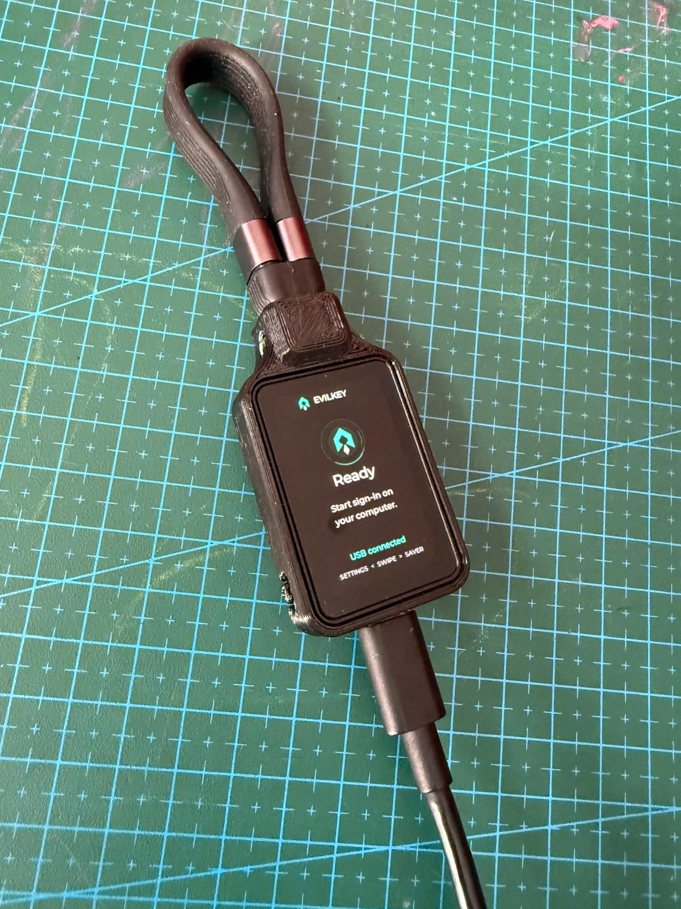
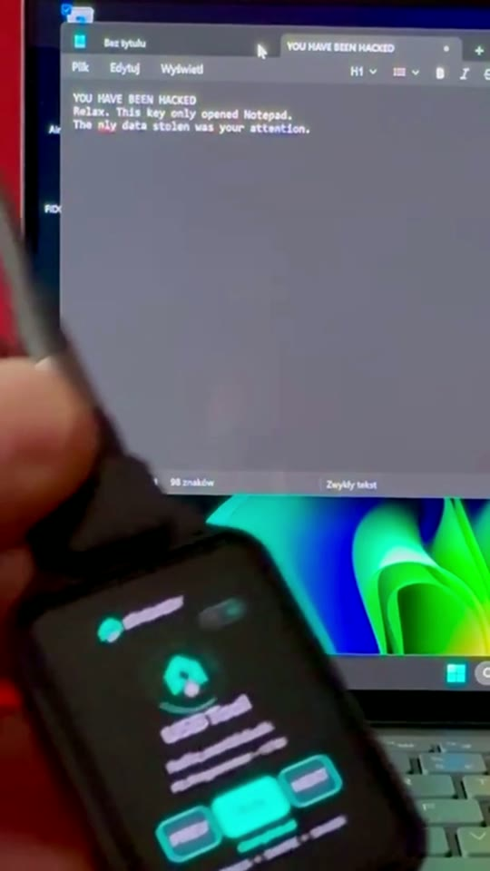
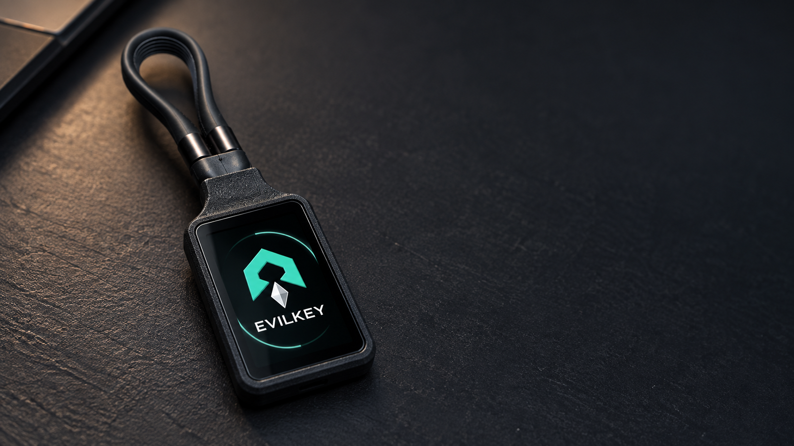
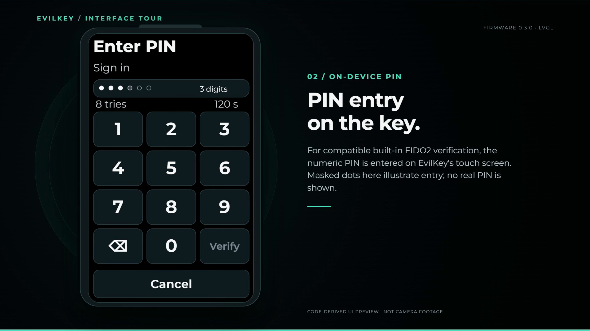
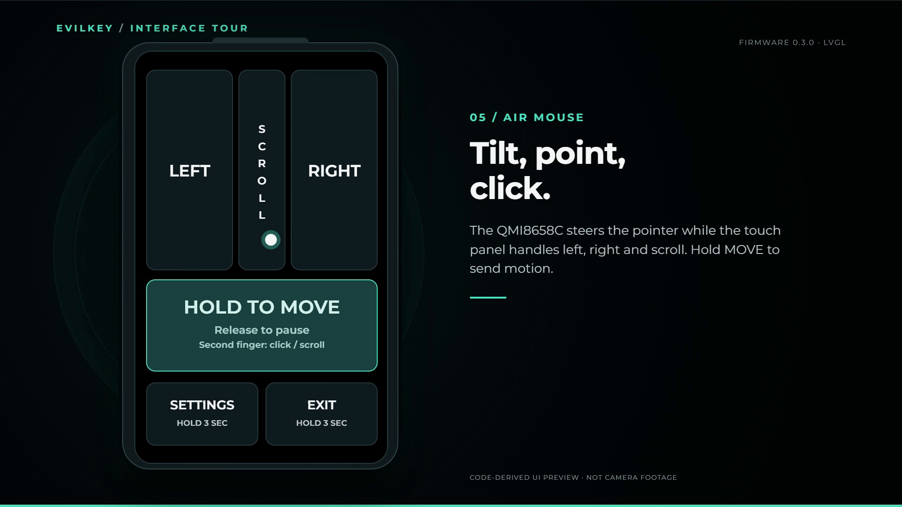
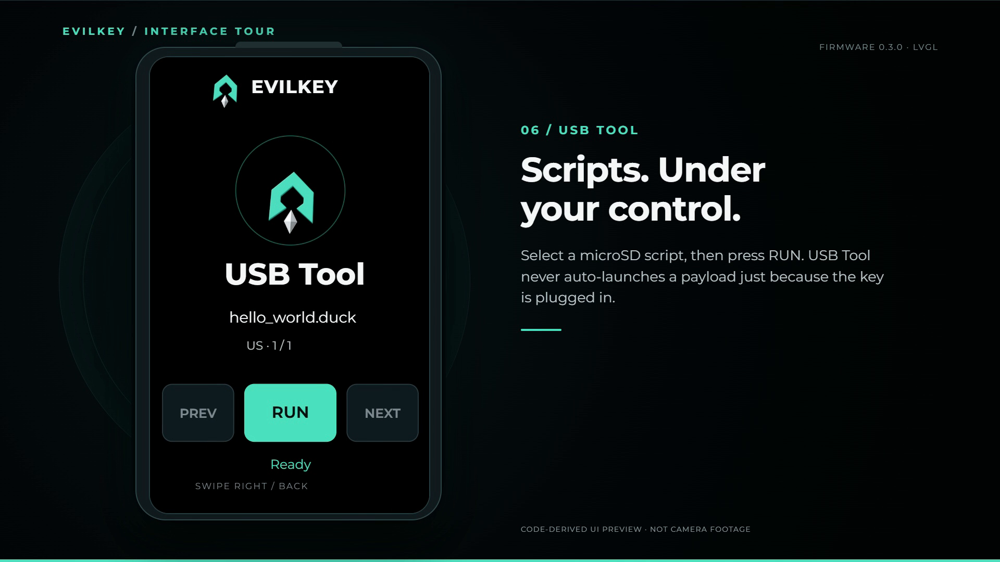
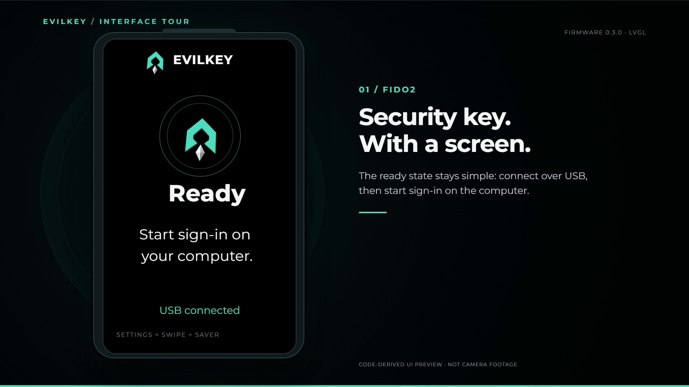
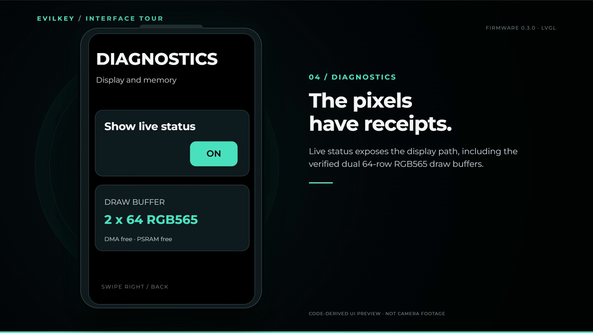
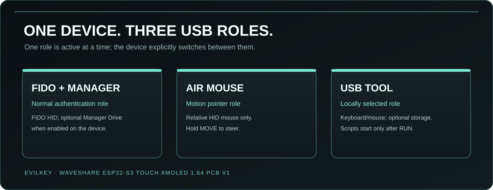

  

  <strong>Firmware and device GUI</strong> ·
  <a href="https://github.com/mwr666/EvilKey-Manager">Windows Manager</a> ·
  <a href="https://github.com/mwr666/EvilKey-examples">microSD examples</a> ·
  <a href="https://hackaday.io/project/206807-evilkey-i-needed-a-fido2-key-then-the-maker-brain-took-over">Hackaday project</a> ·
  <a href="https://www.printables.com/model/1855790-evilkey-v1-enclosure-waveshare-esp32-s3-touch-amol">Printable V1 enclosure</a>

  

# EvilKey firmware

EvilKey is FIDO2 firmware for the **Waveshare ESP32-S3 Touch AMOLED 1.64, PCB V1**. Its touch GUI includes a local PIN keypad for compatible built-in user verification requests, an IMU-powered Air Mouse, diagnostics, USB storage controls and a deliberately activated USB Tool. Standard host-side ClientPIN remains supported. [On-device PIN details](docs/ON_DEVICE_PIN.md) explain the scope and validation limits.

This repository contains the device firmware, LVGL interface, generated upstream source, preparation tools, source notices and installation instructions. It does not contain the separately licensed Manager or microSD examples.

## Watch the real device GUI

<strong><a href="https://cdn.hackaday.io/files/2068078848030688/evilkey-gui-real-silent.mp4">▶ Play the 23-second real-device video</a></strong>

  

Silent camera footage shows the home-printed prototype, its screensaver, touch navigation through Settings and the return to READY. The separate interface panels below are code-derived previews; this video does not show live PIN verification, cursor movement or script execution.

[Download the silent MP4 from this repository](https://github.com/mwr666/EvilKey-firmware/raw/refs/heads/main/docs/github/evilkey-gui-real-silent.mp4).

## Watch USB Tool run a script

[▶ Watch the USB Tool Short](https://youtube.com/shorts/k0a0o6s1Ayg)

USB Tool is a separate USB role. Select a script on EvilKey's touchscreen and press **RUN**; connecting the key does not start a payload. It can send scripted keyboard and mouse input, store results on microSD and use Keystroke Reflection as a return channel when a mass-storage drive is unavailable. Scripts can move files or collect data within the connected host session's permissions and defenses. The Short shows only a harmless HID test on the owner's Windows computer: minimizing windows, opening Notepad and typing a joke. It does **not** demonstrate file transfer, data collection or bypassing a security control. The edit joins two real camera takes with captions and a logo outro.

## Hardware for the PCB V1 USB Tool demo

| Quantity | Component |
| --- | --- |
| 1 | Waveshare ESP32-S3 Touch AMOLED 1.64, **PCB V1** |
| 1 | Short data-capable USB-C cable/loop (Unitek C14179ABK-style in the prototype) |
| 1 | Printed V1 enclosure (the current prototype is home printed) |
| 4 | M2 × 5 mm screws for the module |
| 1 | M5 × 10 mm flat-point grub screw for the cable loop |
| 1 | **FAT32-formatted microSD card** for USB Tool scripts |

The microSD card is needed to reproduce the `hello_world.duck` demo; FIDO2 and Air Mouse work without it. Copy the [public examples](https://github.com/mwr666/EvilKey-examples) `duckyscripts/` tree to the card root; the tested script is `/duckyscripts/test/hello_world.duck`. Card capacity is not specified. See the [Hackaday component list](https://hackaday.io/project/206807/components) and [build instructions](https://hackaday.io/project/206807/instructions).

## Device and interface

  

Concept rendering of the planned black SLS enclosure. The current physical case is a home-printed prototype.

The [printable V1 enclosure](https://www.printables.com/model/1855790-evilkey-v1-enclosure-waveshare-esp32-s3-touch-amol) is available as digital STL and 3MF files on Printables. This enclosure revision has been printed and test-fitted with the Waveshare PCB V1; the listing does not include hardware or a physical print.

### Touch interface

These panels are stills from a code-derived interface preview. They show the intended firmware layout; they are not photographs of the device.

  

For compatible built-in FIDO2 verification, the PIN can be entered on EvilKey's touchscreen.

#### Air Mouse

#### USB Tool

  
More interface panels: Ready and Diagnostics

  

  

### USB roles

  

Only one USB role is active at a time. Switching roles is an explicit action on the key.

## Build and install

Read [installation information](firmware/INSTALLATION_INFORMATION.md) first. From `firmware/`, run `python prepare_arduino.py` and `python build_arduino.py` with the pinned Arduino-ESP32 and Waveshare board packages. `python flash_arduino.py` performs a rebuild and asks for a COM port and explicit confirmation. The upload uses `EraseFlash=none` to preserve NVS, but verify the exact board before flashing.

The [firmware guide](firmware/README.md) explains source generation and the two 64-row RGB565 draw buffers. Device test claims and limits are recorded in [validation](firmware/VALIDATION.md). The [Air Mouse](docs/AIR_MOUSE.md), [USB Tool](docs/USB_TOOL.md) and [Manager Drive](docs/MANAGER_DRIVE.md) documents cover individual roles.

## Related projects

- [EvilKey Manager](https://github.com/mwr666/EvilKey-Manager) — Windows device management and firmware configuration export. Its code is source available under separate noncommercial terms.
- [EvilKey examples](https://github.com/mwr666/EvilKey-examples) — original microSD script examples under separate noncommercial terms. Use security-testing examples only on systems you own or are authorized to test.

I welcome ideas for new EvilKey features. Open an issue with the intended behavior, hardware assumptions and a practical test plan.

Voluntary support is available through [GitHub Sponsors](https://github.com/sponsors/mwr666). Sponsorship is not a software purchase or a kit preorder.

## License and provenance

The EvilKey firmware and device GUI are distributed under GNU AGPL version 3 with upstream notices retained. See [LICENSE.md](LICENSE.md), [NOTICE.md](NOTICE.md), [firmware license](firmware/LICENSE.md) and [source provenance](firmware/docs/SOURCES.md). The Waveshare module is third-party hardware; EvilKey is an independent project.
