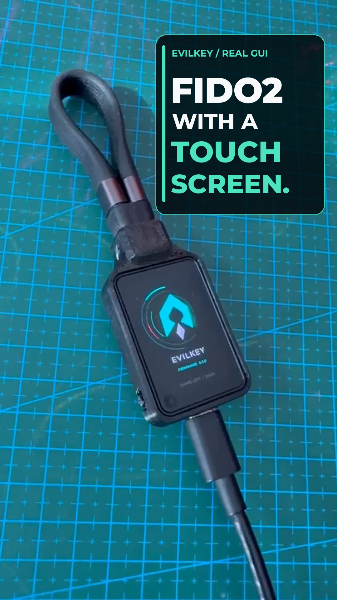
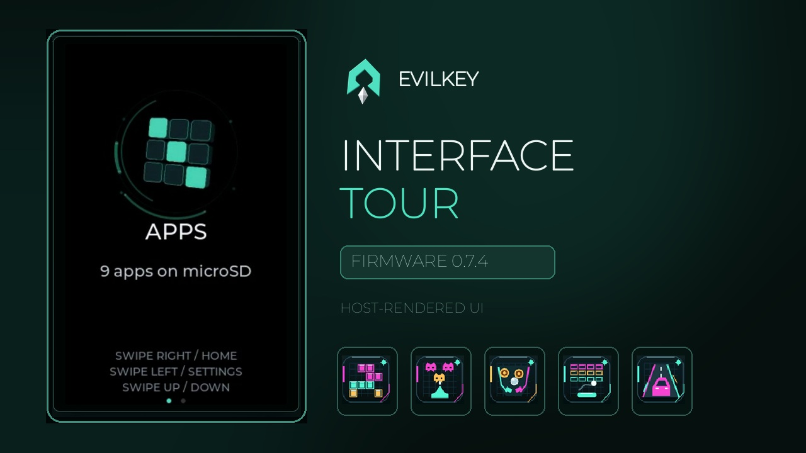
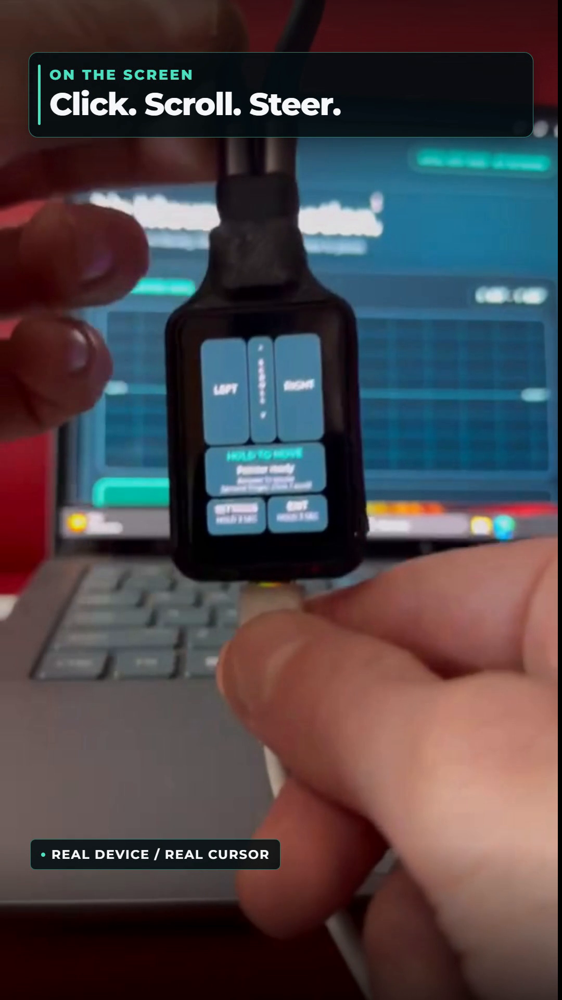
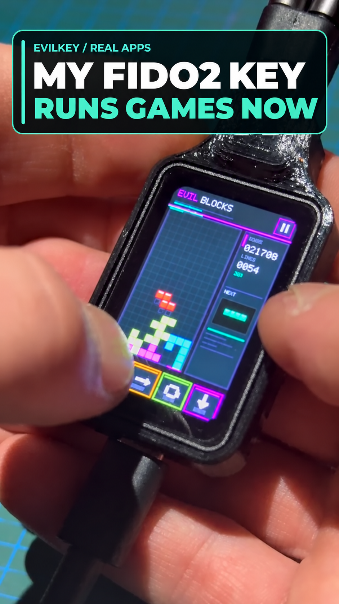

  

  <strong>Firmware and device GUI</strong> ·
  <a href="https://github.com/mwr666/EvilKey-Manager">Windows Manager</a> ·
  <a href="https://github.com/mwr666/EvilKey-examples">microSD examples</a> ·
  <a href="https://hackaday.io/project/206807-evilkey-i-needed-a-fido2-key-then-the-maker-brain-took-over">Hackaday project</a> ·
  <a href="https://www.printables.com/model/1855790-evilkey-v1-enclosure-waveshare-esp32-s3-touch-amol">Printable V1 enclosure</a>

  

# EvilKey firmware

EvilKey 0.7.5 is FIDO2 firmware for the **Waveshare ESP32-S3 Touch AMOLED 1.64, PCB V1**. Its touch GUI includes a local PIN keypad for compatible built-in user verification requests, USB/BLE AirMouse, a landscape BLE Gamepad, diagnostics, USB storage controls, a deliberately activated USB Tool, and Apps loaded from microSD. Standard host-side ClientPIN remains supported. [On-device PIN details](docs/ON_DEVICE_PIN.md) explain the scope and validation limits.

This repository contains the device firmware, Jet renderer, LVGL interface, generated upstream source, preparation tools, source notices and installation instructions. It does not contain the separately licensed Manager or microSD examples.

## 0.7.5 update

The Jet GUI and native Scene3D renderer now split rendering work between both
ESP32-S3 cores. The rasterizer skips pixels outside triangle spans, reuses
transformed cube vertices and reduces separate PSRAM accesses. The existing
graphics and detail are preserved. Jet and ABI v5 were introduced in 0.7.4;
this release improves their rendering paths and coordination with the display.

**Diagnostics → Save report** writes all seven diagnostic cards to one text file
on SD, under `/evilkey/diagnostics/`.

Using **Eject** on the computer now turns off Manager Drive. EvilKey saves the
setting and briefly restarts, reconnecting without USB storage so local apps can
access the card again. Re-enable Manager Drive in Settings when needed.

ABI v4/v5 compatibility and package revision 5 remain. Manager stays at 1.1.6.
[Download 0.7.5](https://github.com/mwr666/EvilKey-firmware/releases/tag/v0.7.5)
· [Getting started](docs/GETTING_STARTED.md) · [Release notes](docs/RELEASE_0.7.5.md).

## Watch the real device GUI

<strong><a href="https://youtube.com/shorts/MK2NCrWpuXo">▶ Watch the real-device GUI Short</a></strong>

  

The silent Short shows the real home-printed prototype and its AMOLED touch interface, ending with an animated EvilKey logo. The separate interface panels below are code-derived previews; this footage does not show live PIN verification, cursor movement or script execution.

## Watch the 0.7.4 interface tour

[▶ Watch the EvilKey 0.7.4 Interface Tour](https://youtu.be/3SmAGgwEm9s)

A longer look at the animated screensaver, PIN interaction, Ready and Settings, Air Mouse, BLE Gamepad, USB Tool and Apps, including EvilBundle gameplay. The device screens use the real firmware UI running on a desktop host; gameplay comes from the host app runtime. PIN and connection/status moments are illustrative. The Shorts on this page show the physical prototype. Separately licensed EvilBundle games are not included in this repository.

## Watch Air Mouse on the real device

[▶ Watch the Air Mouse Short](https://youtube.com/shorts/b0x_XzGABB8)

On the PCB V1 prototype, I select the separate Air Mouse USB role and press **START**. Holding **MOVE** lets the QMI8658 motion sensor steer the computer cursor; releasing it stops movement. The touchscreen handles left and right clicks and scrolling. Holding **EXIT** returns to the normal security-key role. The key, cursor and touch sounds are real footage; the 3D logo and glitch at the end are the brand animation. FIDO2 and Air Mouse are separate USB roles.

## Watch USB Tool run a script

[▶ Watch the USB Tool Short](https://youtube.com/shorts/k0a0o6s1Ayg)

USB Tool is a separate USB role. Select a script on EvilKey's touchscreen and press **RUN**; connecting the key does not start a payload. It can send scripted keyboard and mouse input, store results on microSD and use Keystroke Reflection as a return channel when a mass-storage drive is unavailable. Scripts can move files or collect data within the connected host session's permissions and defenses. The Short shows only a harmless HID test on the owner's Windows computer: minimizing windows, opening Notepad and typing a joke. It does **not** demonstrate file transfer, data collection or bypassing a security control. The edit joins two real camera takes with captions and a logo outro.

## Watch Apps on the real device

[▶ Watch the Apps Short](https://youtube.com/shorts/e-bcwSlzdcg)

I needed a FIDO2 key. It now runs falling blocks and pinball. Apparently I was left unsupervised. This silent Short shows **EvilBlocks and EvilPinball on the real PCB V1 prototype**: select an app from microSD, press **RUN**, then play using the touchscreen. The captions and 3D logo/glitch outro are edited; the gameplay is filmed during development, rather than a benchmark of the latest app builds.

Apps are independent `.ekapp` packages in `/evilkey/apps/`. In **0.7.5**, swipe left from Home to the Apps introduction, swipe up/down for a paged **3×3 icon grid**, then tap an icon. Compatible packages need an embedded name/icon and the `corner-exit-v1` profile. The firmware-owned upper-left grip opens a visible slide-to-exit control and Yes/No confirmation; touches elsewhere remain app-owned. [Firmware 0.7.5](https://github.com/mwr666/EvilKey-firmware/releases/tag/v0.7.5) supports ABI v4 and v5, accelerometer data, RGB565 assets and bounded per-app `.save` files. The tested PCB V1 panel reports one contact, despite the ABI's two-contact capacity. Separately licensed games are not included in the public repositories. The older video shows the launch flow used during its filming.

What app would you put on a device like this? Useful tools and gloriously unnecessary experiments are welcome.

## Hardware for the PCB V1 USB Tool demo

| Quantity | Component |
| --- | --- |
| 1 | Waveshare ESP32-S3 Touch AMOLED 1.64, **PCB V1** |
| 1 | Short data-capable USB-C cable/loop (Unitek C14179ABK-style in the prototype) |
| 1 | Printed V1 enclosure (the current prototype is home printed) |
| 4 | M2 × 5 mm screws for the module |
| 1 | M5 × 10 mm flat-point grub screw for the cable loop |
| 1 | **FAT32-formatted microSD card** for USB Tool scripts |

The microSD card is needed to reproduce the `hello_world.duck` demo; FIDO2 and Air Mouse work without it. Copy the [public examples](https://github.com/mwr666/EvilKey-examples) `duckyscripts/` tree to the card root; the tested script is `/duckyscripts/test/hello_world.duck`. Card capacity is not specified. See the [Hackaday component list](https://hackaday.io/project/206807/components) and [build instructions](https://hackaday.io/project/206807/instructions).

## Device and interface

  

Concept rendering of the planned black SLS enclosure. The current physical case is a home-printed prototype.

The [printable V1 enclosure](https://www.printables.com/model/1855790-evilkey-v1-enclosure-waveshare-esp32-s3-touch-amol) is available as digital STL and 3MF files on Printables. This enclosure revision has been printed and test-fitted with the Waveshare PCB V1; the listing does not include hardware or a physical print.

### On-device PIN — real prototype

  

Real photo of the PCB V1 prototype. The keypad is used for compatible built-in FIDO2 user-verification requests; clients can still request host-side ClientPIN.

### Touch interface

The following panels are stills from a code-derived interface preview. They show the intended firmware layout; the photograph above shows the actual device.

  

For compatible built-in FIDO2 verification, the PIN can be entered on EvilKey's touchscreen.

#### Air Mouse

#### USB Tool

  
More interface panels: Ready and Diagnostics

  

  

### USB roles

  

Only one USB role is active at a time. Switching roles is an explicit action on the key.

## Firmware 0.7.5

- **Apps launcher:** animated introduction, cached card catalog, 3×3 icon pages and a shared corner exit gesture. Home: swipe right for screensaver, left for Apps, then left for Settings. Without compatible apps, left opens Settings directly. Charger-only power still permits navigation.
- **BLE Gamepad:** landscape A/B/X/Y cross, shoulder controls, IMU direction, Center, analog/D-pad mode, dead zone and Rotate 180. PC/Xbox and Generic/Android are BLE HID profiles; native XInput and console compatibility are not established.
- **USB/BLE AirMouse:** hold MOVE to steer; release to stop. Tap DRAG to hold/release the left button and drag with one finger. Clicks and scrolling remain on the touchscreen.
- **Radio lifecycle:** BLE starts only when a BLE module is launched. Exit returns to FIDO with BLE off; Home, Apps, Settings, screensaver and USB roles keep it off.
- **Storage-preserving upload:** guarded NVS initialization and verified migration to a 4 MiB app at `0x500000`; credential/storage offsets are retained.

[Download 0.7.5](https://github.com/mwr666/EvilKey-firmware/releases/tag/v0.7.5) · [Changelog](CHANGELOG.md) · [Gamepad and BLE](docs/BLE_CONTROLS.md) · [AirMouse](docs/AIR_MOUSE.md).

## Apps from microSD

Copy a compatible `.ekapp` into `/evilkey/apps/` on FAT32 microSD. Replace it to update, delete it to remove; keep its adjacent `<id>.save` to retain progress. No install database or firmware rebuild is required for changes within the supported ABI. Revision-5 packages contain their name and 64×64 icon. Older package revisions are rejected.

The [base ABI v4 specification](apps/ABI_V4.md), [ABI v5 native scenes](apps/ABI_V5.md), [MIT SDK](apps/sdk/README.md) and [UI profile](apps/sdk/UI_PROFILE.md) are public. Apps have zero imports and exchange bounded touch, motion, draw, image and save data with firmware. They have no direct NVS/FIDO, USB or networking API. This is an interpreter boundary, not demonstrated hardware isolation. Package SHA-256 detects corruption, not publisher identity.

## Build and install

Open **[EvilKey.cmd](EvilKey.cmd)**: **7** builds, **11** builds/flashes through the storage-preserving uploader, **6** runs software checks and **8** packages source plus the accepted BIN. Read [build/flash](docs/BUILD_AND_FLASH.md) and [installation/rollback](firmware/INSTALLATION_INFORMATION.md). The exact release BIN was accepted on PCB V1; [validation](docs/VALIDATION.md) records scope and SHA-256.

## Development security status

This V1 configuration remains **development-only**: credential material is stored in unencrypted NVS, without Secure Boot or encrypted flash/NVS provisioning. Working sign-ins and storage-preserving updates do not establish resistance to physical extraction or runtime compromise. No FIDO certification or production-key hardening is claimed. See the source guards in `pf_build_config.h` and the validation record.

## Related projects

- [EvilKey Manager](https://github.com/mwr666/EvilKey-Manager) — Windows device management and firmware configuration export. Its code is source available under separate noncommercial terms.
- [EvilKey examples](https://github.com/mwr666/EvilKey-examples) — original microSD script examples under separate noncommercial terms. Use security-testing examples only on systems you own or are authorized to test.

I welcome ideas for new EvilKey features. Open an issue with the intended behavior, hardware assumptions and a practical test plan.

Voluntary support is available through [GitHub Sponsors](https://github.com/sponsors/mwr666). Sponsorship is not a software purchase or a kit preorder.

## License and provenance

The EvilKey firmware and device GUI are distributed under GNU AGPL version 3 with upstream notices retained. See [LICENSE.md](LICENSE.md), [NOTICE.md](NOTICE.md), [firmware license](firmware/LICENSE.md) and [source provenance](firmware/docs/SOURCES.md). The Waveshare module is third-party hardware; EvilKey is an independent project.
